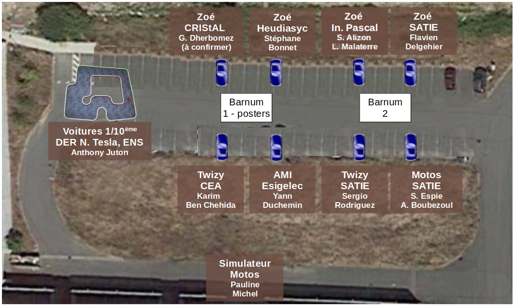

# Démonstrations

L'objectif des démonstrations est de partager autour des outils utilisés pour instrumenter ou contrôler les voitures en vue de leur autonomie.

8 véhicules taille réelle et des véhicules 1/10ème sont prévus, ainsi que la présentation du simulateur de motos.

</img>
