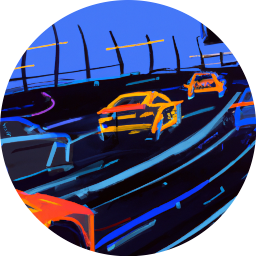

# Journée Outils Logiciels et Matériels pour la Recherche sur les Véhicules Terrestres Autonomes

__Date : 5/10/2023__

__Lieu : ENS Paris Saclay, 4 avenue des Sciences, 91190 Gif Sur Yvette__

Thèmes scientifiques et techniques : voitures autonomes, perception, analyse de scène, conduite automatisée.

</img>

La diversification des systèmes de conduite automatisée (service de navettes autonomes, essais de robots-taxis, robots-livreurs, augmentation des niveaux d’autonomie des voitures particulières) montre que la conduite autonome pour les transports reste un sujet de recherche très dynamique, partagé entre les laboratoires et les entreprises. 

L’objectif de cette journée, organisée par l’ENS Paris Saclay, le Réseau métier des Roboticiens et Mécatroniciens (2RM / CNRS) et le GT2 (véhicules terrestres autonomes) du GDR robotique (CNRS), est d’échanger à propos des outils déployés ou développés par les laboratoires de recherche pour mener des expériences sur les problématiques propres des véhicules terrestres autonomes. Dans ce domaine, nous constatons une forte émergence de moyens expérimentaux autour de :

* la simulation,
* les capteurs,
* les environnements de développement,
* les architectures matérielles,
* les voitures à échelle réduite,
* les prototypes à échelle réelle (ex. robotisation de véhicules de série).

De plus, les méthodologies basées sur l’apprentissage profond ont un besoin accru de bases de données issues de ces outils et leur accessibilité à la communauté scientifique.

Dans ce sens, la journée sera organisée en 4 sessions successives comprenant :

* Des présentations orientées sur les outils technologiques sur la recherche appliquée
* Des démonstrations de prototypes et d’outils logiciels.

La restauration est prise en charge par le réseau métiers des roboticiens et mécatroniciens (2RM).

L'inscription est gratuite mais obligatoire : [lien vers les inscriptions](https://evento.renater.fr/survey/inscription-journee-5-10-23-outils-logiciels-et-materiels-pour-la-recherche-sur-les-vehicules-terrestres-autonomes-i7ohgx69)

L'appel à contribution est terminé et le programme finalisé. Les personnes souhaitant présenter leurs travaux sous forme de poster (format A0, template sur ce site) ou présenter leur plateforme lors des démonstrations peuvent encore envoyer, par e-mail, leur proposition aux organisateurs.

</img>

Organisateurs :

* Sergio Rodriguez sergio.rodriguez@universite-paris-saclay.fr,
* Anthony Juton anthony.juton@ens-paris-saclay.fr,
* François Marmoiton francois.marmoiton@uca.fr
* Stephane Bonnet stephane.bonnet@hds.utc.fr
* Gerald Dherbomez gerald.dherbomez@univ-lille.fr
* Cindy Cappelle cindy.cappelle@univ-lille.fr

</img>

### Venir à l'ENS Paris Saclay

Les indications pour se rendre à l'ENS Paris Saclay sont sur la page web : [Venir à l'ENS Paris Saclay](https://ens-paris-saclay.fr/lecole/venir-lecole)

### Mise à disposition des contribution

Le [dépôt Git](https://github.com/ajuton-ens/JOLoMaRVTA) accueillera les contributions mises à disposition.

</img>